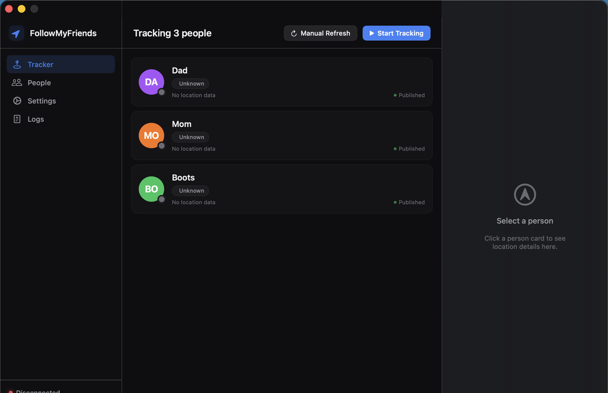
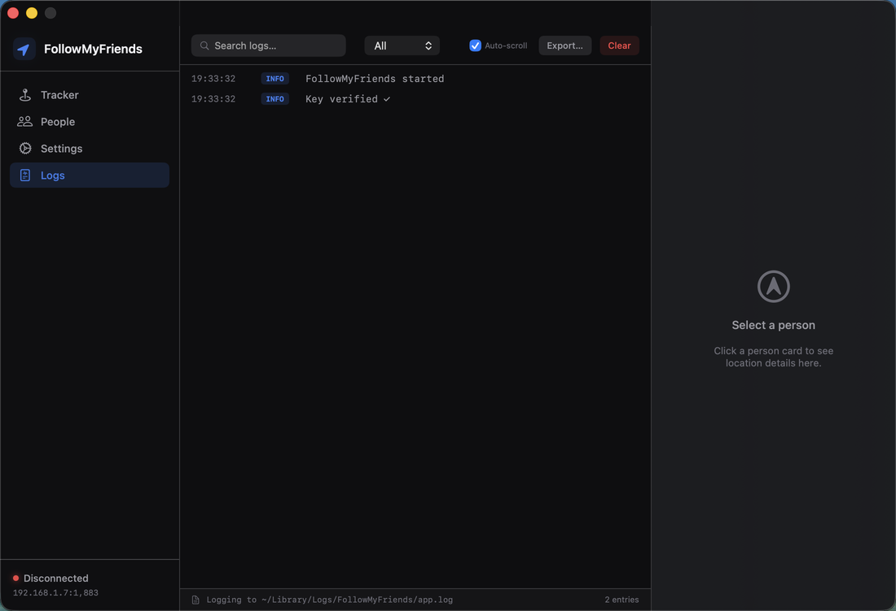

# FollowMyFriends

**Bridge Apple Find My friends to Home Assistant — automatically, privately, no cloud required.**

FollowMyFriends is a native macOS menu-bar app that reads your friends' locations directly from the Apple Find My database on your Mac and publishes them to Home Assistant via MQTT. No third-party accounts, no location-sharing APIs, no cloud relay — just your local network.

[](https://www.apple.com/macos/)
[](https://swift.org)
[](LICENSE)
[](https://github.com/bytePatrol/FollowMyFriends/releases)

---

## Screenshots

<p align="center">
  
  <br><em>Tracker Dashboard — live status for each tracked person with MQTT publish state</em>
</p>

<p align="center">
  
  <br><em>Live Log View — searchable, filterable real-time log with export support</em>
</p>

---

## How It Works

Apple's Find My app stores your friends' GPS locations in an encrypted SQLite database at:

```
~/Library/Group Containers/group.com.apple.findmy.findmylocateagent/
  Library/Application Support/LocalStorage.db
```

FollowMyFriends:

1. **Decrypts** the database using a locally-stored AES-256 key (extracted once with [findmy-key-extractor](https://github.com/manonstreet/findmy-key-extractor))
2. **Merges the WAL** (Write-Ahead Log) to get the freshest location data — `findmylocateagent` writes here every ~20 minutes
3. **Parses** the binary plist location payload for each friend
4. **Publishes** to Home Assistant via MQTT using the [MQTT Device Tracker](https://www.home-assistant.io/integrations/device_tracker/) integration with auto-discovery

---

## Features

### 🗺️ Live Location Tracking
- Reads GPS coordinates, accuracy radius, altitude, speed, and motion state (stationary/moving) for every Find My friend
- Detects and publishes `locationLabel` — Home Assistant location names like Home, Work, or custom places
- Publishes `home` / `not_home` state per the Home Assistant device tracker spec

### 🔄 Smart Polling with WAL Watcher
- **WAL file watcher**: instantly reacts when `findmylocateagent` writes new location data — no fixed poll interval required
- **Configurable poll schedule**: set min/max intervals with optional randomisation to prevent predictable patterns
- **Night mode**: automatically pause tracking during configurable quiet hours to reduce unnecessary activity
- **Manual refresh**: trigger an immediate read at any time with one click

### 🏠 Home Assistant Integration (Auto-Discovery)
- Publishes MQTT discovery payloads so device trackers appear in Home Assistant automatically — zero manual YAML
- Attributes published per person: `latitude`, `longitude`, `gps_accuracy`, `motion_state`, `location_label`, `last_update`, `location_timestamp`
- Configurable topic prefix (default: `homeassistant/device_tracker/`)
- Retained discovery and attribute messages survive MQTT broker restarts
- Re-publishes discovery on every reconnect

### 🔐 Privacy-First Architecture
- All data stays on your local network — no cloud services, no external APIs
- AES-256 encryption key stored locally on your Mac (never transmitted)
- MQTT credentials stored securely in macOS Keychain
- No app sandbox — required to access Find My's protected database directory via user-granted folder access (NSOpenPanel)

### 🔑 Permissions Without Full Disk Access
- macOS Sequoia blocks Full Disk Access for ad-hoc signed apps — FollowMyFriends works around this by requesting user-intent access to the Find My Application Support **folder** via a standard file picker dialog
- One-time grant; persists across launches
- No SIP bypass, no scripting additions, no privileged helpers

### 📋 Detailed Logging
- Colour-coded live log with categories: INFO, MQTT, DECRYPT, WAL, ERROR
- GPS fix freshness indicator — shows exactly how old Apple's data is and highlights when a new fix arrives (★)
- Searchable and filterable by category
- Export to file for debugging

### ⚙️ Full Settings UI
- MQTT host, port, username, password, topic prefix
- Poll intervals (min/max) with randomisation toggle
- Find My wait time (how long to keep Find My open per poll cycle)
- Night mode start/end times
- "Grant FindMy Folder Access" button always accessible
- One-click connection test

### 🚀 Launch at Login
- Register as a Login Item via standard macOS `SMAppService` API
- Optionally opens Find My invisibly in the background (`activates: false, hides: true`) each poll cycle to trigger `findmylocateagent` server polls

---

## Requirements

| Requirement | Details |
|---|---|
| macOS | 14.0 Sonoma or later |
| Find My | Must have at least one friend sharing location with you |
| AES Key | 32-byte key extracted from `findmylocateagent` (one-time setup) |
| MQTT Broker | Any MQTT 3.1.1 broker (Mosquitto, EMQX, Home Assistant Mosquitto add-on) |
| Home Assistant | Any recent version with MQTT integration enabled |

---

## Installation

### Option A — Download the DMG (Recommended)

1. Download `FollowMyFriends-1.0.dmg` from the [latest release](https://github.com/bytePatrol/FollowMyFriends/releases/latest)
2. Open the DMG and drag **FollowMyFriends** to your Applications folder
3. Launch the app — it will prompt you to grant folder access on first run

### Option B — Build from Source

**Prerequisites:** Xcode 16+, [XcodeGen](https://github.com/yonaskolb/XcodeGen)

```bash
# Clone the repo
git clone https://github.com/bytePatrol/FollowMyFriends.git
cd FollowMyFriends

# Generate the Xcode project
xcodegen generate

# Build
xcodebuild -project FollowMyFriends.xcodeproj \
           -scheme FollowMyFriends \
           -configuration Release \
           build
```

---

## First-Time Setup

### 1. Extract the AES Key

FollowMyFriends needs a 32-byte AES key to decrypt the Find My database. Extract it **once** while Find My is open using [findmy-key-extractor](https://github.com/manonstreet/findmy-key-extractor):

```bash
# Follow the instructions in that repo — it uses lldb to intercept sqlite3_key_v2()
# The result is a 32-byte binary file, e.g. LocalStorage.key
```

Save the key file somewhere permanent on your Mac (e.g. `~/Documents/LocalStorage.key`).

### 2. Configure the App

1. Launch FollowMyFriends
2. Go to **Settings → Application** and click **"Grant FindMy Folder Access…"** — select the folder:
   ```
   ~/Library/Group Containers/group.com.apple.findmy.findmylocateagent/Library/Application Support/
   ```
3. In **Settings → Key File**, point to your `LocalStorage.key`
4. In **Settings → MQTT Connection**, enter your broker host, port, username, and password
5. Click **Test Connection** to verify
6. Click **Save**, then **Start Tracking** on the dashboard

### 3. Home Assistant

Ensure the [MQTT integration](https://www.home-assistant.io/integrations/mqtt/) is set up. Device trackers will appear automatically under **Settings → Devices & Services → MQTT** within seconds of the first publish.

---

## MQTT Payload Reference

**Discovery topic:** `homeassistant/device_tracker/{slug}/config` *(retained)*

**State topic:** `{prefix}{slug}/state` → `"home"` or `"not_home"`

**Attributes topic:** `{prefix}{slug}/attributes` *(retained)*

```json
{
  "latitude": 37.334900,
  "longitude": -122.009020,
  "gps_accuracy": 4.2,
  "motion_state": "Stationary",
  "location_label": "Home",
  "last_update": "2026-03-03T19:30:00Z",
  "location_timestamp": "2026-03-03T19:12:44Z"
}
```

> **Slug format:** display name → lowercase, spaces → `_`, `@` → `_at_`
> Example: `"Mom"` → `mom`, `"John Smith"` → `john_smith`

---

## Architecture

```
FollowMyFriends/
├── App/                    # Entry point, assets, app icon
├── Models/                 # AppSettings, TrackedPerson, LocationUpdate, LogEntry
├── Services/
│   ├── FindMyDecryptor     # AES-256-CBC-XOR page decryption
│   ├── WALMerger           # SQLite WAL frame parsing and merge
│   ├── WALWatcher          # kqueue file-system watcher for live WAL updates
│   ├── BplistParser        # Binary plist location payload decoder
│   ├── DatabaseReader      # Full read pipeline (DB + WAL → friends + locations)
│   ├── MQTTService         # CocoaMQTT wrapper, discovery, state, attributes
│   ├── TrackingScheduler   # Interval/randomisation/night-mode logic
│   ├── FindMyLauncher      # Opens Find My invisibly to trigger server polls
│   ├── KeychainHelper      # Secure credential storage
│   ├── LoginItemService    # SMAppService launch-at-login
│   └── NotificationService # macOS user notifications
├── ViewModels/
│   └── AppState            # @Observable root ViewModel, owns all services
└── Views/
    ├── MainWindow          # NavigationSplitView shell
    ├── Sidebar/            # Nav + MQTT status badge
    ├── Dashboard/          # Person cards, tracking controls
    ├── Detail/             # Map + location detail panel
    ├── People/             # People management list
    ├── Settings/           # Full settings form
    ├── Logs/               # Live log viewer
    └── Shared/             # Color tokens, reusable components
```

**Key design decisions:**
- `@Observable @MainActor AppState` is the single root ViewModel — no global singletons
- Swift 6 strict concurrency throughout — all actor isolation verified at compile time
- WAL frames always override main DB pages (last-frame-per-page-wins merge)
- WAL read is an atomic snapshot (`Data(contentsOf:)`) to prevent checkpoint races

---

## Dependencies

| Package | Purpose |
|---|---|
| [CocoaMQTT](https://github.com/emqx/CocoaMQTT) | MQTT 3.1.1 client (Swift Package Manager) |

All decryption, WAL parsing, and bplist decoding is implemented natively — no SQLCipher, no Python, no external crypto libraries.

---

## License

MIT — see [LICENSE](LICENSE)

---

## Acknowledgements

- [findmy-key-extractor](https://github.com/manonstreet/findmy-key-extractor) by manonstreet — for the lldb-based key extraction technique
- Apple's `findmylocateagent` for doing the heavy lifting of polling Apple's servers
